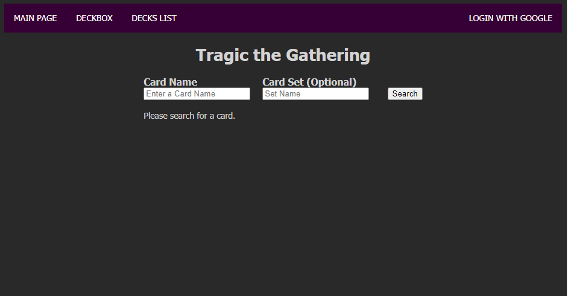
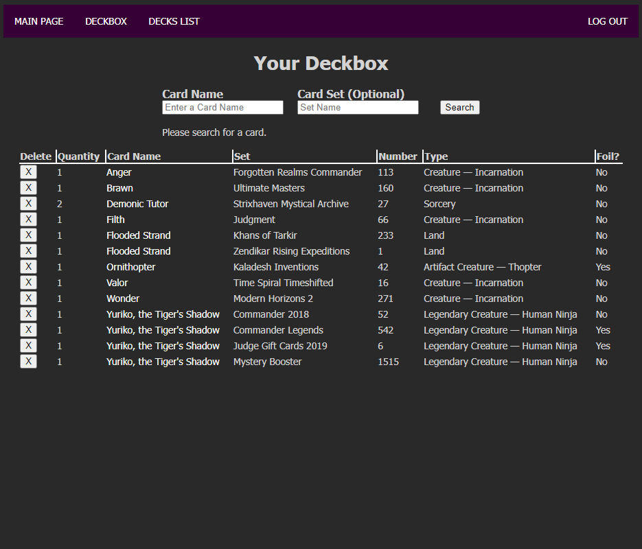
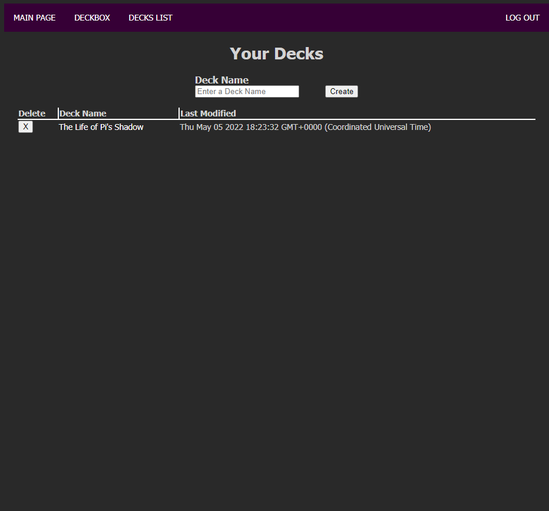
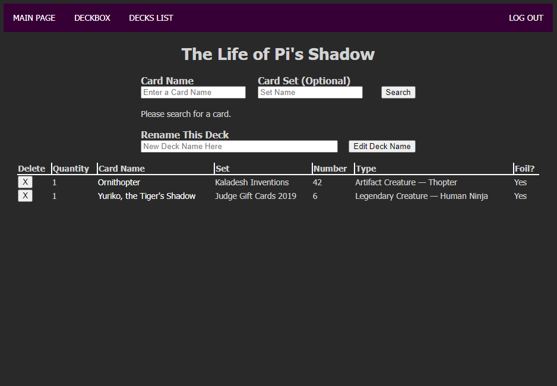
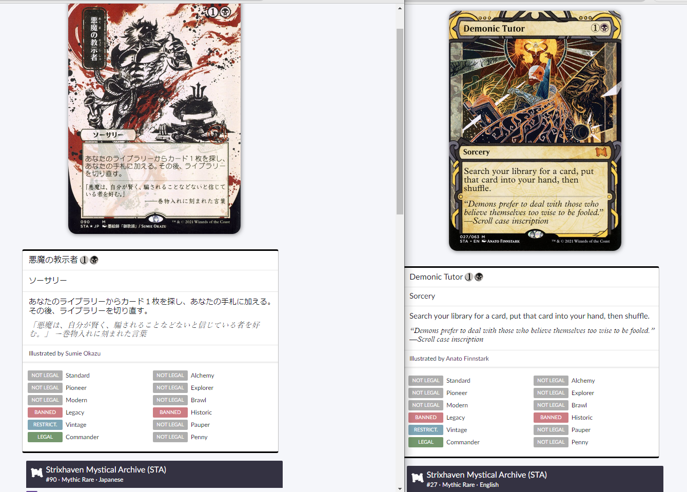

# Tragic, the Gathering

### Background

Trading Card Games can be great fun, when played with friends of similar mindsets and with decks of similar power levels, but let's be real, even with all that, sometimes the game is absolutely not in your favour and sometimes...it's just tragic. Especially when you have to sort through thousands and thousands of cards. Here we are, gotta sort them at some point somehow...

---

### Screenshots

#### Front Page (Anyone can search for cards here)

#### Deckbox (Signed-in users can log their cards here)

#### List of Decks (Signed-in users can log their decks here)

#### Decklists (Signed-in users can change their decks here)

---

### Technologies Used

* HTML(including EJS)/CSS
* node.js/Express
* MongoDB/Mongoose
* Scryfall API
* A lot of caffeine 
* Google
* Stack Overflow 

---

### Getting Started

Instructions: 
* Grab your boxes of cards
* Try not to cry about how many cards you have
* Go to the link below:
* [Click here to begin](https://tragic-the-gathering.herokuapp.com)

---

### Next Steps

Planned future enhancements include using SPA to simply display the card by clicking on the name rather than requiring a different page to see the card.

Also on the list is the ability to choose whether you have a foil copy or not (this is half done but I couldn't stop getting errors in time), as well as the printing version, because of multiple versions from the same set such as this:
